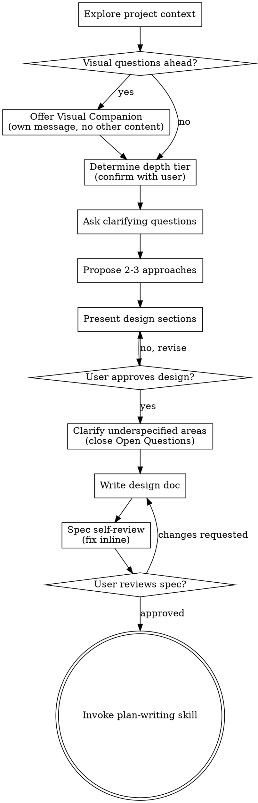

# Brainstorming Ideas Into Designs

## Lifecycle & Vocabulary

This skill is the first stage of a two-stage pipeline. The shared contract
between stages lives in dedicated reference files - read them once before
you start producing a spec:

- `references/plan-lifecycle.md` - pipeline diagram and handoff rules.
- `references/spec-contract.md` - required structure of every spec document.

Same vocabulary is used by `plan-writing`:

| Term | Meaning |
|---|---|
| spec | Design document - what & why. Produced here. |
| plan | Implementation document - how, step by step. Produced by `plan-writing`. |
| task | Plan unit fitting 10 min OR 100 lines of new code. |
| step | Single action inside a task (2-5 min). |

Help turn ideas into fully formed designs and specs through natural collaborative dialogue.

Start by understanding the current project context, then ask questions one at a time to refine the idea. Once you understand what you're building, present the design and get user approval.

<HARD-GATE>
Do NOT invoke any implementation skill, write any code, scaffold any project, or take any implementation action until you have presented a design and the user has approved it. This applies to EVERY project regardless of perceived simplicity.
</HARD-GATE>

## Anti-Pattern: "This Is Too Simple To Need A Design"

Every project goes through this process. A todo list, a single-function utility, a config change — all of them. "Simple" projects are where unexamined assumptions cause the most wasted work. The design can be short (a few sentences for truly simple projects), but you MUST present it and get approval.

## Checklist

You MUST create a task for each of these items and complete them in order:

1. **Explore project context** — check files, docs, recent commits
2. **Offer visual companion** (if topic will involve visual questions) — this is its own message, not combined with a clarifying question. See the Visual Companion section below.
3. **Determine depth tier** — auto-classify Quick/Standard/Deep, state it, let the user confirm or adjust. See `references/depth-tiers.md`.
4. **Ask clarifying questions** — one at a time, understand purpose/constraints/success criteria. Use the Interactive Question Channel when available.
5. **Propose 2-3 approaches** — with trade-offs and your recommendation
6. **Present design** — in sections scaled to tier and complexity, get user approval after each section
7. **Clarify underspecified areas** — run the scale-adaptive ambiguity sweep so `Open Questions` ends empty. See `references/clarify-checklist.md`.
8. **Write design doc** — save the spec (default path and commit per Documentation below); section depth per tier; all 8 contract headings always present
9. **Spec self-review** — quick inline check for placeholders, contradictions, ambiguity, scope (see below)
10. **User reviews written spec** — ask user to review the spec file, then transition to plan-writing

## Process Flow

**The terminal state is invoking plan-writing.** Do NOT invoke frontend-design, mcp-builder, or any other implementation skill. The ONLY skill you invoke after brainstorming is plan-writing.

## The Process

**Understanding the idea:**

- Check out the current project state first (files, docs, recent commits)
- Before asking detailed questions, assess scope: if the request describes multiple independent subsystems (e.g., "build a platform with chat, file storage, billing, and analytics"), flag this immediately. Don't spend questions refining details of a project that needs to be decomposed first.
- If the project is too large for a single spec, help the user decompose into sub-projects: what are the independent pieces, how do they relate, what order should they be built? Then brainstorm the first sub-project through the normal design flow. Each sub-project gets its own spec → plan → implementation cycle.
- For appropriately-scoped projects, ask questions one at a time to refine the idea
- Prefer multiple choice questions when possible, but open-ended is fine too
- Only one question per message - if a topic needs more exploration, break it into multiple questions
- Focus on understanding: purpose, constraints, success criteria

**Exploring approaches:**

- Propose 2-3 different approaches with trade-offs
- Present options conversationally with your recommendation and reasoning
- Lead with your recommended option and explain why

**Presenting the design:**

- Once you believe you understand what you're building, present the design
- Scale each section to the chosen depth tier and its complexity (see `references/depth-tiers.md`): a few sentences on Quick, fuller paragraphs on Deep
- Ask after each section whether it looks right so far
- Cover: architecture, components, data flow, error handling, testing
- Be ready to go back and clarify if something doesn't make sense

**Design for isolation and clarity:**

- Break the system into smaller units that each have one clear purpose, communicate through well-defined interfaces, and can be understood and tested independently
- For each unit, you should be able to answer: what does it do, how do you use it, and what does it depend on?
- Can someone understand what a unit does without reading its internals? Can you change the internals without breaking consumers? If not, the boundaries need work.
- Smaller, well-bounded units are also easier for you to work with - you reason better about code you can hold in context at once, and your edits are more reliable when files are focused. When a file grows large, that's often a signal that it's doing too much.

**Working in existing codebases:**

- Explore the current structure before proposing changes. Follow existing patterns.
- Where existing code has problems that affect the work (e.g., a file that's grown too large, unclear boundaries, tangled responsibilities), include targeted improvements as part of the design - the way a good developer improves code they're working in.
- Don't propose unrelated refactoring. Stay focused on what serves the current goal.

## After the Design

**Clarify first.** Before writing the spec, complete the ambiguity sweep
from `references/clarify-checklist.md` (scaled to the depth tier). The spec
is written only once `Open Questions` can be `(none)`.

**Documentation:**

- Record the confirmed depth tier as a `> Tier: <Quick|Standard|Deep>` blockquote on the first line of the spec, above `# Goal` (format defined in `references/spec-contract.md`). This is what lets `plan-writing` inherit the tier.
- Write the validated design (spec) to `<plan-root>-spec.md` in the same directory as the plan.
  - `<plan-root>` = the plan filename stripped of its extension and any descriptive suffix after the numeric segment.
    - `plan01.md` → root `plan01` → spec `plan01-spec.md`
    - `plan02-goal.md` → root `plan02` → spec `plan02-spec.md`
    - `superplan03-abstract.md` → root `superplan03` → spec `superplan03-spec.md`
  - (User preferences for spec location override this default)
- The spec MUST conform to `references/spec-contract.md` (all 8 required sections present; `Open Questions` empty before handoff).
- Write clearly and concisely; prefer short sentences and concrete nouns
- Commit the design document to git

**Spec Self-Review:**
After writing the spec document, look at it with fresh eyes:

1. **Placeholder scan:** Any "TBD", "TODO", incomplete sections, or vague requirements? Fix them.
2. **Internal consistency:** Do any sections contradict each other? Does the architecture match the feature descriptions?
3. **Scope check:** Is this focused enough for a single implementation plan, or does it need decomposition?
4. **Ambiguity check:** Could any requirement be interpreted two different ways? If so, pick one and make it explicit.

Fix any issues inline. No need to re-review — just fix and move on.

**User Review Gate:**
After the spec review loop passes, ask the user to review the written spec before proceeding:

> "Spec written and committed to `<path>`. Please review it and let me know if you want to make any changes before we start writing out the implementation plan."

Wait for the user's response. If they request changes, make them and re-run the spec review loop. Only proceed once the user approves.

**Implementation:**

- **STOP-condition.** Do NOT invoke `plan-writing` unless ALL of the following are true:
  1. Spec self-review checklist passed.
  2. User explicitly approved the written spec file.
  3. Spec satisfies `references/spec-contract.md` (preflight checklist).
- Invoke the plan-writing skill to create a detailed implementation plan.
- Do NOT invoke any other skill. plan-writing is the next step.

## Interactive Question Channel

When the host provides an interactive question UI (multiple-choice / buttons),
deliver clarifying questions and confirmations through it: one question per
prompt, list the options, allow a free-text answer, and mark the recommended
option. When no such UI is available, ask the same question as inline text.
Either way the rule is unchanged: **one question at a time.**

## Key Principles

- **One question at a time** - Don't overwhelm with multiple questions
- **Multiple choice preferred** - Easier to answer than open-ended when possible
- **YAGNI ruthlessly** - Remove unnecessary features from all designs
- **Explore alternatives** - Always propose 2-3 approaches before settling
- **Incremental validation** - Present design, get approval before moving on
- **Be flexible** - Go back and clarify when something doesn't make sense
- **Evals exist** - the skill's own gates are pressure-tested in `references/eval-scenarios.md`

## Visual Companion

A browser-based companion for showing mockups, diagrams, and visual options during brainstorming. Available as a tool — not a mode. Accepting the companion means it's available for questions that benefit from visual treatment; it does NOT mean every question goes through the browser.

**Offering the companion:** When you anticipate that upcoming questions will involve visual content (mockups, layouts, diagrams), offer it once for consent:
> "Some of what we're working on might be easier to explain if I can show it to you in a web browser. I can put together mockups, diagrams, comparisons, and other visuals as we go. This feature is still new and can be token-intensive. Want to try it? (Requires opening a local URL)"

**This offer MUST be its own message.** Do not combine it with clarifying questions, context summaries, or any other content. The message should contain ONLY the offer above and nothing else. Wait for the user's response before continuing. If they decline, proceed with text-only brainstorming.

**Per-question decision:** Even after the user accepts, decide FOR EACH QUESTION whether to use the browser or the terminal. The test: **would the user understand this better by seeing it than reading it?**

- **Use the browser** for content that IS visual — mockups, wireframes, layout comparisons, architecture diagrams, side-by-side visual designs
- **Use the terminal** for content that is text — requirements questions, conceptual choices, tradeoff lists, A/B/C/D text options, scope decisions

A question about a UI topic is not automatically a visual question. "What does personality mean in this context?" is a conceptual question — use the terminal. "Which wizard layout works better?" is a visual question — use the browser.

If they agree to the companion, read the detailed guide before proceeding:
`visual-companion.md` (relative to this skill's directory)
