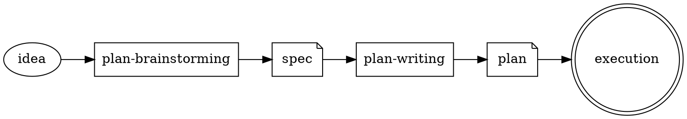

# Plan Lifecycle

Shared reference for the `plan-brainstorming` and `plan-writing` skills.
Both SKILL.md files link here instead of duplicating the contract.

## Pipeline

Each arrow is a forward, one-way transition. Backward transitions (e.g. "the
plan revealed a missing spec section") happen only through the user - never
as an automatic call from a later skill back into an earlier one.

## Artifacts

| Artifact | Path | Owner skill | Definition |
|---|---|---|---|
| idea | (chat / chat input) | - | Raw user intent |
| spec | `<plan-root>-spec.md` | `plan-brainstorming` | What & why; the agreed design |
| impl | `<plan-root>-impl.md` (same dir as spec) | `plan-writing` | How; bite-sized implementation tasks with steps |

**Naming derivation:** `<plan-root>` = plan filename minus extension, minus any
descriptive suffix after the numeric segment.  
Examples: `plan01.md` → spec `plan01-spec.md` → impl `plan01-impl.md`;
`plan02-goal.md` → `plan02-spec.md` → `plan02-impl.md`;
`superplan03-abstract.md` → `superplan03-spec.md` → `superplan03-impl.md`.

| execution result | code + commits | `subagent-driven-development` / `executing-plans` | Working software |

## Handoff Rules

1. **Spec -> Plan handoff** is allowed only after both:
   - spec self-review passed (in `plan-brainstorming`);
   - user explicitly approved the written spec file.
2. **Plan -> Spec backward transition** is *not* an automatic call.
   If `plan-writing` finds the spec incomplete or non-conforming
   (see `spec-contract.md`), it must STOP and ask the user to re-enter
   `plan-brainstorming`. No silent auto-invoke.
3. **Single source of truth per artifact.** A spec has exactly one owning
   skill (`plan-brainstorming`); a plan has exactly one owning skill
   (`plan-writing`). Other skills may read but not silently rewrite.

## Glossary

| Term | Meaning |
|---|---|
| spec | Design document. Answers "what and why". |
| plan | Implementation document. Answers "how, step by step". |
| task | A unit of plan work that fits within 10 minutes OR 100 lines of new code. |
| step | A single action inside a task (2-5 minutes), tracked via `- [ ]`. |
| handoff | One-way transition between pipeline stages, gated by an explicit user approval. |
| tier | Spec depth level (Quick / Standard / Deep). See `depth-tiers.md`. |

## Related Files

- `spec-contract.md` - required section structure for spec documents.
- `../SKILL.md` - `plan-brainstorming` (this skill's entry).
- `../../plan-writing/SKILL.md` - `plan-writing` consumer.
