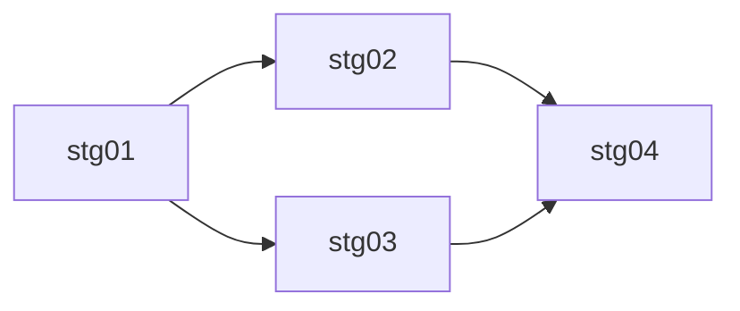

# Roadmap: {{PLAN_TITLE}}

> Source: [{{BASE_NAME}}.md](./{{BASE_NAME}}.md)
> Generated: {{ISO8601_UTC}}
> Stages: {{N}}

## Overview

{{OVERVIEW_2_3_SENTENCES}}

## Dependency graph

| Stage | Title | Depends on | Parallel group | Weight |
|-------|-------|------------|----------------|--------|
| stg01 | {{TITLE_1}} | — | A | 🔴 heavy |
| stg02 | {{TITLE_2}} | stg01 | B | 🟡 medium |
| stg03 | {{TITLE_3}} | stg01 | B | 🟢 light |
| stg04 | {{TITLE_4}} | stg02, stg03 | C | 🟡 medium |

### Parallel groups

- **Group A** (blocking): stg01 — runs first, blocks the rest.
- **Group B** (parallel): stg02, stg03 — can run concurrently after group A.
- **Group C**: stg04 — runs only after group B completes.

### Visualization (Mermaid)

## Stages

### stg01: {{TITLE_1}}
- **File**: [{{BASE_NAME}}-stg01.md](./{{BASE_NAME}}-stg01.md)
- **Depends on**: —
- **Blocks**: stg02, stg03
- **Weight**: 🔴 heavy
- **Summary**: {{SHORT_1}}

### stg02: {{TITLE_2}}
- **File**: [{{BASE_NAME}}-stg02.md](./{{BASE_NAME}}-stg02.md)
- **Depends on**: stg01
- **Blocks**: stg04
- **Weight**: 🟡 medium
- **Summary**: {{SHORT_2}}

### stg03: {{TITLE_3}}
- **File**: [{{BASE_NAME}}-stg03.md](./{{BASE_NAME}}-stg03.md)
- **Depends on**: stg01
- **Blocks**: stg04
- **Weight**: 🟢 light
- **Summary**: {{SHORT_3}}

### stg04: {{TITLE_4}}
- **File**: [{{BASE_NAME}}-stg04.md](./{{BASE_NAME}}-stg04.md)
- **Depends on**: stg02, stg03
- **Blocks**: —
- **Weight**: 🟡 medium
- **Summary**: {{SHORT_4}}
