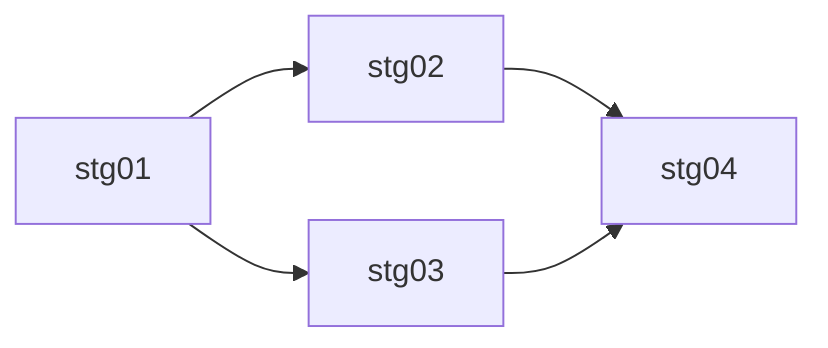

# Roadmap: {{PLAN_TITLE}}

> Источник: [{{BASE_NAME}}.md](./{{BASE_NAME}}.md)
> Сгенерировано: {{ISO8601_UTC}}
> Стадий: {{N}}

## Обзор

{{OVERVIEW_2_3_SENTENCES}}

## Граф зависимостей

| Стадия | Название | Зависит от | Параллельная группа | Вес |
|--------|----------|------------|---------------------|-----|
| stg01 | {{TITLE_1}} | — | A | 🔴 heavy |
| stg02 | {{TITLE_2}} | stg01 | B | 🟡 medium |
| stg03 | {{TITLE_3}} | stg01 | B | 🟢 light |
| stg04 | {{TITLE_4}} | stg02, stg03 | C | 🟡 medium |

### Параллельные группы

- **Группа A** (блокирующая): stg01 — выполняется первой, блокирует все остальные.
- **Группа B** (параллельная): stg02, stg03 — можно выполнять одновременно после группы A.
- **Группа C**: stg04 — только после завершения группы B.

### Визуализация (Mermaid)

## Стадии

### stg01: {{TITLE_1}}
- **Файл**: [{{BASE_NAME}}-stg01.md](./{{BASE_NAME}}-stg01.md)
- **Зависит от**: —
- **Блокирует**: stg02, stg03
- **Вес**: 🔴 heavy
- **Краткое содержание**: {{SHORT_1}}

### stg02: {{TITLE_2}}
- **Файл**: [{{BASE_NAME}}-stg02.md](./{{BASE_NAME}}-stg02.md)
- **Зависит от**: stg01
- **Блокирует**: stg04
- **Вес**: 🟡 medium
- **Краткое содержание**: {{SHORT_2}}

### stg03: {{TITLE_3}}
- **Файл**: [{{BASE_NAME}}-stg03.md](./{{BASE_NAME}}-stg03.md)
- **Зависит от**: stg01
- **Блокирует**: stg04
- **Вес**: 🟢 light
- **Краткое содержание**: {{SHORT_3}}

### stg04: {{TITLE_4}}
- **Файл**: [{{BASE_NAME}}-stg04.md](./{{BASE_NAME}}-stg04.md)
- **Зависит от**: stg02, stg03
- **Блокирует**: —
- **Вес**: 🟡 medium
- **Краткое содержание**: {{SHORT_4}}
