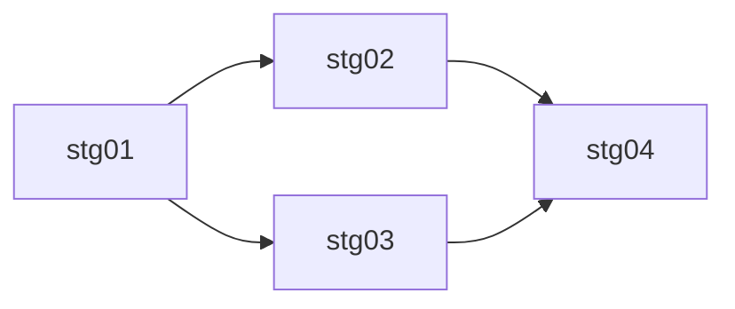

# ROADMAP-FORMAT — формат roadmap-файла и правила параллельных групп

## 1. Имя файла

Строго `<base_name>-stg00-roadmap.md`. Префикс `stg00` означает «нулевая стадия» = карта.

## 2. Обязательные секции

1. `# Roadmap: <Название плана>` (или `# Roadmap:` в EN)
2. Шапка-блок-цитата с метаданными: `Источник`, `Сгенерировано` (ISO-8601 UTC), `Стадий: N`.
3. `## Обзор` (`## Overview`) — 2–3 предложения.
4. `## Граф зависимостей` (`## Dependency graph`) — таблица + параллельные группы + Mermaid.
5. `## Стадии` (`## Stages`) — список с ссылками на каждый stg-файл.

## 3. Таблица зависимостей

Обязательные колонки (в указанном порядке):

| Стадия | Название | Зависит от | Параллельная группа | Вес |

- **Стадия**: `stgNN` (lowercase, двузначное число).
- **Название**: краткий заголовок стадии (1–4 слова).
- **Зависит от**: `—` или список через запятую (`stg01, stg02`).
- **Параллельная группа**: буква (`A`, `B`, `C`, ...) или пустая, если стадия одиночная.
- **Вес**: 🔴 heavy / 🟡 medium / 🟢 light. **Обязателен**.

## 4. Параллельные группы

### Правила формирования

- Группа A — всегда первая (стадии без зависимостей или с одинаковыми зависимостями).
- Группы нумеруются буквами по топологическому порядку: A → B → C → ...
- Стадии внутри одной группы **не могут** зависеть друг от друга. (Проверяется `validate-all`.)
- Если стадия не имеет «соседей» по группе — указать её одиночную группу (например, `C`), не оставлять пустым.

### Когда стадии параллельны

- Не читают/пишут одни и те же файлы.
- Результат одной не является входом другой.
- Не требуют координации (например, обе не меняют одну схему БД).

### Когда стадии блокируют друг друга

- Стадия B использует артефакт, создаваемый A.
- Стадия B расширяет/модифицирует то, что создала A.
- Стадия B нуждается в знаниях/решениях, принятых в A.

## 5. Mermaid-диаграмма

> ⚠️ **Проверяется автоматически.** `validate-roadmap` и `validate-all` проверяют:
> (a) наличие блока `` ```mermaid ``; (b) наличие хотя бы одного ребра (`-->`).
> Отсутствие = `valid: false`, агент обязан добавить диаграмму до прохождения VERIFY.

В `## Граф зависимостей` обязательно присутствует Mermaid:



Правила:
- Направление `LR` (left-to-right) предпочтительно; `TB` допускается для длинных графов.
- Каждая дуга соответствует `depends` в таблице.
- Не должно быть циклов (`validate-all` проверяет автоматически).

## 6. Гибридный формат: таблица + Mermaid

Таблица — для машинного разбора (`validate-roadmap`, `validate-all`).
Mermaid — для человеческого восприятия.

Эти два представления **должны быть согласованы**: каждая дуга в Mermaid соответствует записи `depends` в таблице, и наоборот.

## 7. Секция «Стадии»

Для каждой стадии — блок:

```markdown
### stgNN: <Название>
- **Файл**: [<base>-stgNN.md](./<base>-stgNN.md)
- **Зависит от**: <список или «—»>
- **Блокирует**: <список или «—»>
- **Вес**: <🔴/🟡/🟢>
- **Краткое содержание**: <1–2 предложения>
```

Ссылка `Файл` должна указывать на реально существующий stg-файл (проверяется `validate-all`).
